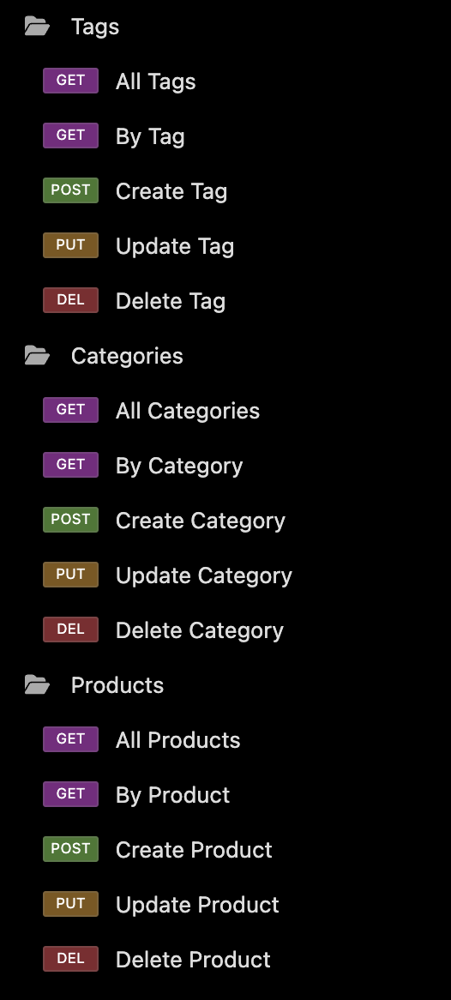

<p align="center">
  
</p>

<h1 align="center">Vespucci</h3>

<p align="center"><i>Trading is the name of the game.</i></p>

<p align="center">
  <a href="https://github.com/Rod-Freedom/C13-Vespucci/blob/main/LICENSE"></a>
</p>

<br>
<br>

## **ABOUT THE PROJECT**
### **Overview**

The Vespucci API is designed to streamline and enhance e-commerce operations with a robust suite of tools. Whether you're building a new online store or integrating with an existing platform, Vespucci offers comprehensive functionalities to support various trading needs.

*Find the repo [**here**](https://github.com/Rod-Freedom/C13-Vespucci).* <br>
*Watch our tutorial [**here**](https://youtu.be/fO3v9G5R15Y).*

<br>
<br>

## Table of Contents
- [License](#license)
- [Resources](#resources)
- [Get Started](#get-started)
- [Usage](#usage)
- [Demos](#demos)
- [Testing](#testing)
- [Contribute](#contribute)
- [Credits](#credits)

<br>

[(Back to the Top)](#about-the-project)

## Resources
* For JavaScript
    * ES6 modules.
    * Promises.
    * Extensive object and array destructuring.
    * Polymorphism for methods.
    * Classes and constructors.
    * Extended classes.
    * `async` and `await` executions.
    * `try` & `catch` executions.
    * Structured error handling to prevent unexpected crashes.
    * `console.table()` to display SQL tables.
* For Sequelize
    * Models.
    * `Models.create()`
    * `Models.destroy()`
    * `Models.update()`
    * `Models.findAll()`
    * `Models.findByPk()`
    * `Models.hasOne()`
    * `Models.hasMany()`
    * `Models.belongsTo()`
    * `onDelete`, `foreignKey`, `autoIncrement`, etc.
    * Hooks
* For Express.js
    * `app.post()`
    * `app.get()`
    * `app.put()`
    * `app.delete()`
    * `app.Router()`
    * `app.use()`
* For Node.js
    * NPM packages
        * PG
        * Dotenv
        * Express.js
        * Sequelize
    * `process.env` variables.
* For SQL
    * `CREATE`
    * `SELECT`
    * `UPDATE`
    * `DELETE`
    * `AS` for column and table aliases
    * `JOIN` `LEFT`, `INTO`, `RIGHT`, etc. to join even to the same table.
    * `INSERT INTO`
    * `FROM`, `ON` & `WHERE`
    * `sum()` & `count()`
    * `GROUP BY` & `ORDER BY`

<br>

[(Back to the Top)](#about-the-project)

## Get Started
*Watch our tutorial [**here**](https://youtu.be/fO3v9G5R15Y).*

Vespucci isn't online yet, so you'll have to run it locally.

Once you have the repo on your computer after running `git clone`, open your command line. Make sure to open the Vespucci repo folder in your terminal. Use `npm i` to install all the modules needed to run ***Vespucci***.

First clone:
```bash
$ git clone https://github.com/Rod-Freedom/C13-Vespucci.git
```

<br>

Then install the modules:
```bash
$ npm i
```

<br>

Then create the DB by opening PostgreSQL in your terminal and running the schema file:
```bash
postgres= \i db/schema.sql
```

<br>

Finally, exit postgres and run the seeds, and you're ready to go.
```bash
$ npm run seed
```

<br>

> **IMPORTANT |** *You need to have PostgreSQL installed in your computer to run Vespucci!*

<br>

[(Back to the Top)](#about-the-project)

## Usage
*Watch our tutorial [**here**](https://youtu.be/fO3v9G5R15Y).*

***Vespucci*** work as any RESTful API. To run it locally, open the Vespucci folder in your terminal, then type `node server.js` or `npm start` and hit `enter`.
```bash
$ npm start
```

The first time you run Vespucci, you'll have to provide you PostgreSQL username and password.

```bash
Welcome! You need to set your user first.
? Whats your PostgreSQL username? user
? Type your PostgreSQL password **********
? Please confirm your password **********
Wait a sec, Vespucci is doing its magic!
✔ Creating your database...
✔ Creating tables...
All set! Please rerun Vespucci!
```

<br>

After that, run `npm start` again, and you're ready to start puppeteering your databases!
```bash
$ npm start
```

<br>

You have `GET`, `POST`, `PUT` and `DELETE` methods for each route.
The available routes for /api, are: 
* /tag
* /categories
* /products

When doing a `PUT` or `DELETE`, you'll have to add the ID parameter route (/id) to target a specific product, tag or category.
You may also do it with `GET`.

<br>

<p align="left">
  
</p>

<br>

[(Back to the Top)](#about-the-project)

## License
<br>
See the [license](https://github.com/Rod-Freedom/C13-Vespucci/blob/main/LICENSE) for more details.

<br>

[(Back to the Top)](#about-the-project)

## Contribute
If you have suggestions or want to help with some improvements, you can write me by [email](mailto:rod@alpacaazul.mx).

<br>

[(Back to the Top)](#about-the-project)

## Credits
The code was created by [Rod's Freedom](https://github.com/Rod-Freedom) from some initial edX BootCamp code.

<br>

[(Back to the Top)](#about-the-project)